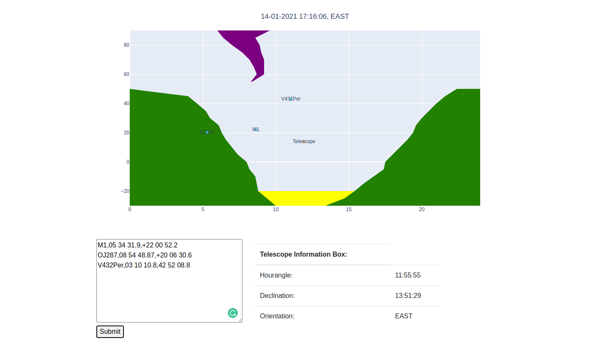

# Web_telescope_coordinates
## Real time telescope coordinates visualization

The software in this repository has as goal to visualize the coordinates of the Suhora Observatory telescope in real time. The position of the telescope is renewed every two seconds.  

Main Tasks:  
* Providing the choice to the user to insert the name, right ascension and declination of the object that is needed to be observed.
* Displaying the trace of this object on the map
* Displaying the areas of the sky that the telescope is forbidden to observe on east and west
* Displaying the coordinates that the telescope is targetting
* Providing an information box about the right ascension, the declination and the orientation of the telescope the moment of the observation  

In order for this to be succeeded, the telescope needed to be in constant communication with the software. In case there is no connection with the telescope, there is no telescope trace on the map.  

There is also a csv file provided with example objects for testing (ra_dec_array.csv)  

For its deployment Docker was used.
The communication between the telescope and the script was done using Modbus.
The visualization of the result was commited with Dash plotly and bootstrap
*for more information about Modbus visit https://modbus.org/*

******************************************************************

